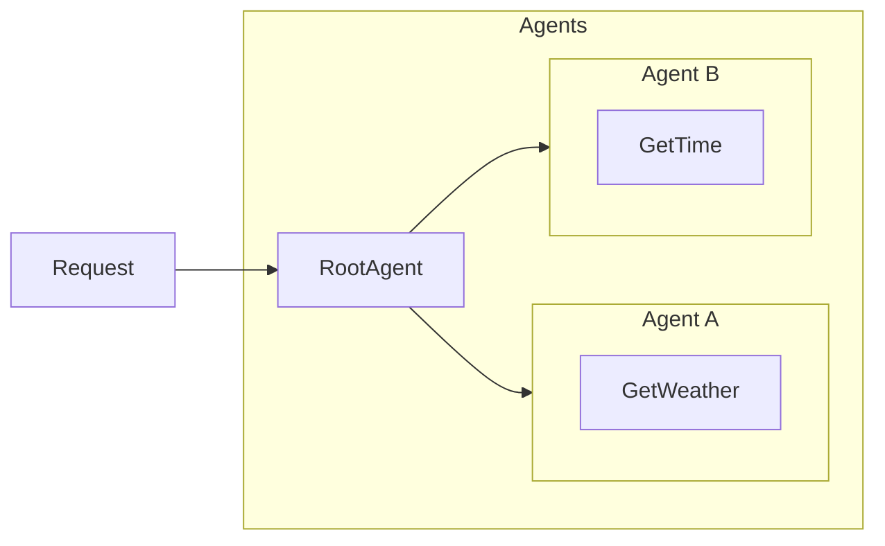

# a2a-go-demo

Ref: <https://google.github.io/adk-docs/get-started/quickstart/>

## Architecture

```mermaid

graph LR
    RootAgent --> AgentA
    RootAgent --> AgentB

    subgraph AgentA[Agent A]
        GetWeather
    end

    subgraph AgentB[Agent B]
        GetTime
    end

    subgraph Agents
       RootAgent
       AgentA
       AgentB
    end

    Request --> RootAgent
```
