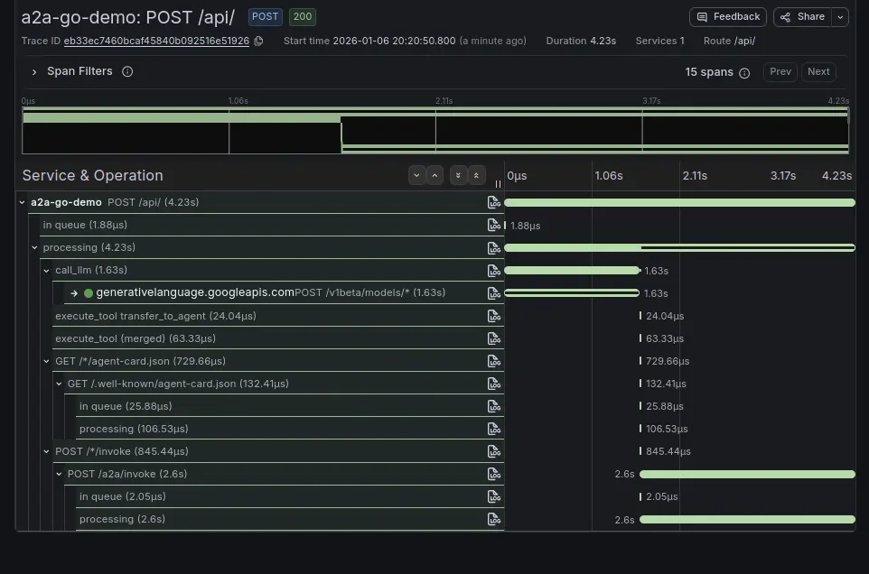
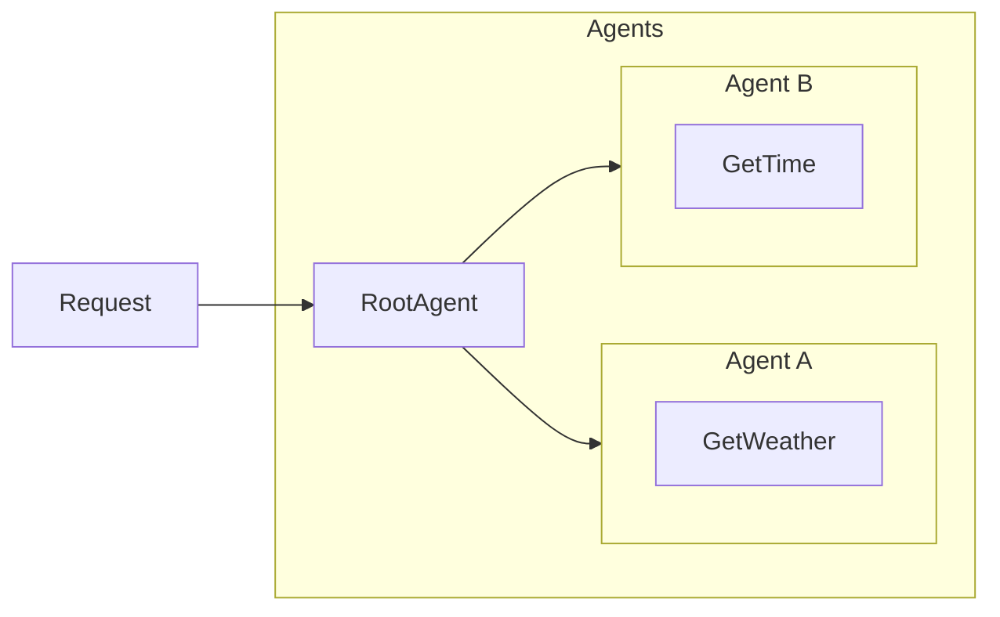

# a2a-go-demo

Ref: <https://google.github.io/adk-docs/get-started/quickstart/>

Python implementation: <https://github.com/kahnwong/a2a-demo>

## Extras

Go implementation includes tracing.

```bash
curl -LO https://github.com/grafana/beyla/releases/download/v2.8.4/beyla-linux-amd64-v2.8.4.tar.gz
tar xzf beyla-linux-amd64-v2.8.4.tar.gz
sudo mv beyla /usr/local/bin/
```



## Usage

```bash
make start-lgtm
make start-bela

make start-agent-a
make start-agent-b
make start-agent-root
```

## Architecture


